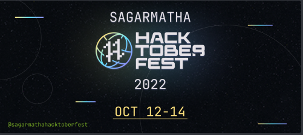

# Your First Pull Request

    

    The goal of this project is to get started with Open Source and make your first <a href="https://docs.github.com/en/free-pro-team@latest/github/collaborating-with-issues-and-pull-requests/about-pull-requests">Pull Request(PR)</a>.

This is a beginner-friendly repository made specifically for the [Hacktoberfest](https://hacktoberfest.digitalocean.com/) and helps you get started with your first PR and takes you a step closer to earning your Hacktoberfest T-shirt :shirt:

## Register in Sagarmatha Hacktoberfest Nepal 2022

- Visit [Hacktoberfest 2022](https://hacktoberfest.com) website and our Event to [register](https://docs.google.com/forms/d/e/1FAIpQLSccFFawVpyZSatmlKD30v4TULUYPf2s1-vRwAy12OKH6KWghA/viewform).
- Register using GitHub :octocat: or GitLab
- Open Pull Requests in any valid repositories between Oct 1 - Oct 31 :rocket:

## Creating a Pull Request

- Fork this repo :fork_and_knife:
- Add your name, GitHub profile link and technology you work on, on [CONTRIBUTORS.md](./CONTRIBUTORS.md) :raising_hand_woman: :raising_hand_man:
- Under menu item [`Pull requests`](https://github.com/Hacktoberfest-Nepal/Your-First-PR/pulls), click on [`New Pull Request`](https://github.com/Hacktoberfest-Nepal/Your-First-PR/compare)
- Provide a title and description
- Click `Create Pull Request`

### Hurray!!! You just got closer to completing your hacktoberfest challenge. :smiley:

## Code of Conduct

> Usage of foul language, addition of irrelevant links to [`CONTRIBUTORS.md`](./CONTRIBUTORS.md) will lead to PR being tagged as spam

## Check your Hacktoberfest Contribution status at:

<a href="https://hacktoberfest.digitalocean.com/profile" target="blank">https://hacktoberfest.digitalocean.com/profile</a>

### Happy?? Star :star: this Repo. :star_struck:

> Initiated By Aju with :heart:\
> Open Source Contributors &copy; 2022
