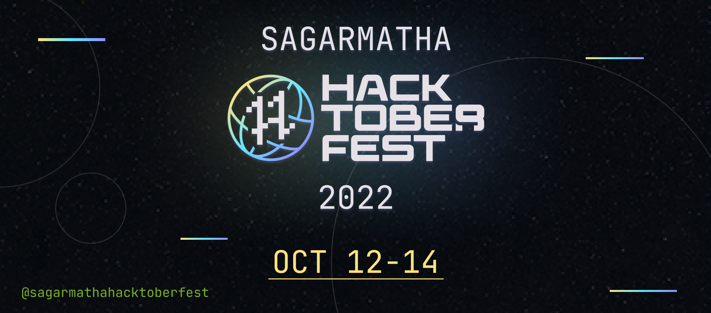

# Your First Pull Request

<p align="center">
    
</p>

<p align="center">
    The goal of this project is to get started with Open Source and make your first <a href="https://docs.github.com/en/free-pro-team@latest/github/collaborating-with-issues-and-pull-requests/about-pull-requests">Pull Request(PR)</a>.
</p>

This is a beginner-friendly repository made specifically for the [Hacktoberfest](https://hacktoberfest.digitalocean.com/) and helps you get started with your first PR and takes you a step closer to earning your Hacktoberfest Swags 👕.

🎯 In case you are an intermediate or advanced level programmer or developer, we have got you covered too!! Step to our <a href="https://github.com/Hacktoberfest-Nepal" target="blank"> repositories</a>[which will be live soon] and make contributions as per as your interests.

## Register in Sagarmatha Hacktoberfest 2022

- Visit [Hacktoberfest 2020](https://hacktoberfest.digitalocean.com) website 🎃 and our [Event](https://forms.gle/fLGVeeBYkJAQqRSNA) to register.
- Register using GitHub :octocat:
- Open Pull Request between Oct 1 - Oct 31 🚀

## Some info about Sagarmatha Hacktoberfest 2022
```
Though Hacktoberfest event has already started from Oct 1 but the events that we have planned for you who have less idea about Open Source Contributions, Git/Github and more from oct 12-14 where we will host muliple events like:
    - Introduction to Open Source
    - Career in Open Source
    - Git/Github Workshop and Hacktoberfest step by step guide
    - Open Source Hardware
    - Open Source Project Licensing
    - Open Sourc Alternative
    - And Finally, Open Source Project Demonstration

Also on Oct 15 we will host session for you guys to interact help to make your 4 PR's
```
Till then stay connected on our social media handles: <br>
Facebook: https://www.facebook.com/sagarmathahacktoberfest <br>
Instagram: https://www.instagram.com/sagarmatha.hacktoberfest/ <br>
LinkedIn: https://www.linkedin.com/company/sagarmatha-hacktoberfest/ <br>
Twitter: https://twitter.com/SHacktoberfest/

<b> Without further delay let's dive in to make your first PR</b>

## Creating Your First Pull Request

- Fork this repo 🍴
- Add your name, GitHub profile link and  technology you work on, on [CONTRIBUTORS.md](./CONTRIBUTORS.md) 🙋‍♀️ 🙋‍♂️ <br>
- Here is the [sample](./assets/example.png).
- Under menu item [`Pull requests`](https://github.com/coolbrg/Your-First-PR/pulls), click on `New Pull Request`
- Provide a title and description
- Click `Create Pull Request`
  
  Hola! You did it🥳
  #### NOTE: It might take a while to merge the PR because of festivals so have patience till then keep contributing in other projects

#### <i>Also get connected with the person of your interest by connecting with the social media handle attached on their github profile :)</i>

### Hurray!!! You just got closer to completing your hacktoberfest challenge. 😃

## Important Links to work for Hacktoberfest

<!-- - [Hacktoberfest_backend](https://github.com/Hacktoberfest-Nepal/Hacktoberfest_backend)
- [Hacktoberfest_CTF](https://github.com/Hacktoberfest-Nepal/Hacktoberfest_CTF)
- [Hacktoberfest_datascience](https://github.com/Hacktoberfest-Nepal/Hacktoberfest_datascience)
- [Hacktoberfest_frontend](https://github.com/Hacktoberfest-Nepal/Hacktoberfest_frontend) -->
-  We are woking on to add more so stay tuned
- [Sagarmatha Hacktoberfest Website](https://github.com/Hacktoberfest-Nepal/HacktoberfestNepal)
- [Your-First-PR](https://github.com/Hacktoberfest-Nepal/Your-First-PR)

## Code of Conduct

> Usage of foul language, addition of irrelevant links to `CONTRIBUTORS.md` will lead to PR being tagged as spam`

## Check your Hacktoberfest Contribution status at:

<a href="https://hacktoberfest.digitalocean.com/profile" target="blank">https://hacktoberfest.digitalocean.com/profile</a>

### Have you made your first PR?? Then Star ⭐ this Repo. 🤩

> Initiated By Sagarmatha Hacktoberfest Team with ❤️
> Open Source contributors &copy; 2022
