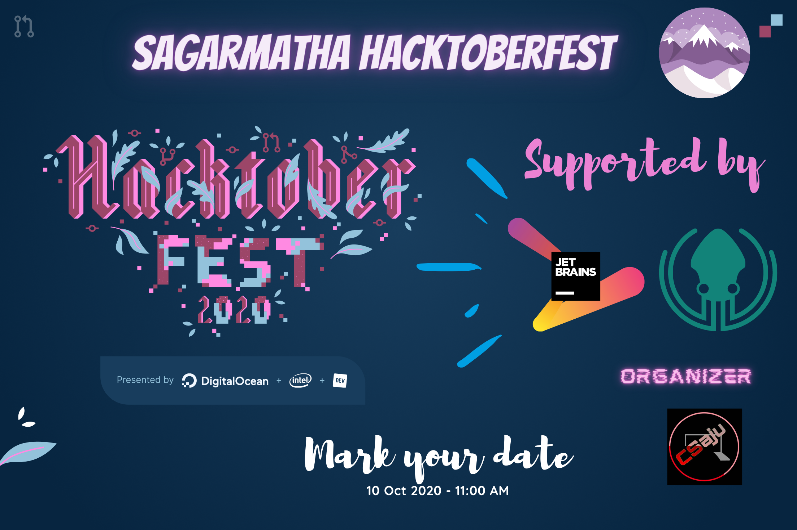

# Your First Pull Request

    

    The goal of this project is to get started with Open Source and make your first <a href="https://docs.github.com/en/free-pro-team@latest/github/collaborating-with-issues-and-pull-requests/about-pull-requests">Pull Request(PR)</a>.

This is a beginner-friendly repository made specifically for the [Hacktoberfest](https://hacktoberfest.digitalocean.com/) and  helps you get started with your first PR and takes you a step closer to earning your Hacktoberfest T-shirt 👕.

🎯 In case you are an intermediate or advanced level programmer or developer, we have got you covered too!! Step to our <a href="https://github.com/Hacktoberfest-Nepal" target="blank"> repositories</a> and make contributions as per as your interests.

## Register in Hacktoberfest Nepal 2020

- Visit [Hacktoberfest 2020](https://hacktoberfest.digitalocean.com) website 🎃 and our [Event](https://organize.mlh.io/participants/events/4462-hacktoberfest-nepal-meetup) to register.
- Register using GitHub :octocat:
- Open Pull Request between Oct 1 - Oct 31 🚀

## Creating a Pull Request

- Fork this repo 🍴
- Add your name, GitHub profile link and technology you work on, on [CONTRIBUTORS.md](./CONTRIBUTORS.md) 🙋‍♀️ 🙋‍♂️  
- Make sure that your info should be in alphabetical order. Here is the [sample](./assets/example.png).
- Under menu item [`Pull requests`](https://github.com/coolbrg/Your-First-PR/pulls), click on `New Pull Request`
- Provide a title and description
- Click `Create Pull Request`

### Hurray!!! You just got closer to completing your hacktoberfest challenge. 😃

## Important Links to work for Hacktoberfest

- [Hacktoberfest_backend](https://github.com/Hacktoberfest-Nepal/Hacktoberfest_backend)
- [Hacktoberfest_CTF](https://github.com/Hacktoberfest-Nepal/Hacktoberfest_CTF)
- [Hacktoberfest_datascience](https://github.com/Hacktoberfest-Nepal/Hacktoberfest_datascience)
- [Hacktoberfest_frontend](https://github.com/Hacktoberfest-Nepal/Hacktoberfest_frontend)
- [HacktoberfestNepal](https://github.com/Hacktoberfest-Nepal/HacktoberfestNepal)
- [Your-First-PR](https://github.com/Hacktoberfest-Nepal/Your-First-PR)

## Code of Conduct

> Usage of foul language, addition of irrelevant links to `CONTRIBUTORS.md` will lead to PR being tagged as spam`

## Check your Hacktoberfest Contribution status at:

<a href="https://hacktoberfest.digitalocean.com/profile" target="blank">https://hacktoberfest.digitalocean.com/profile</a>

### Happy?? Star ⭐ this Repo. 🤩

> Initiate By Aju with ❤️
> Open Source contributors &copy; 2020
